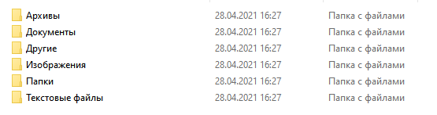

**Оконное приложение с использованием PyQt5 для сортировки файлов.**

Для запуска программы запустите `run.bat` или напрямую `main.py`.

Чтобы добавить папку для сортировки нажмите +, а для удаления выделите папку и нажмите -. Когда вы выбрали все папки,
нажмите 'Начать сортировку'.

Внимание! Все файлы будут перемещены в новые папки, 
поэтому не сортируйте файлы которые зависят от их местоположения.
            
Вы также можете нажать на кнопку настройки
для редактирования сортировки по вашему усмотрению.

В настройках вы можете редактировать или добавить новый тип или файл.

До сортировки

После сортировки

Так, в папке '_текстовые файлы_' файлы будут лежать так:

Аналогично файлы и папки сортируются так, как мы указали в настройках

К проекту приложена папка `test`, которую вы можете использовать для тестирования работы программы.
https://youtu.be/C1qbvDQGzhk  демонстрация работы программы.
https://youtu.be/Ls--5mTjO0Y демонстрация работы настроек
